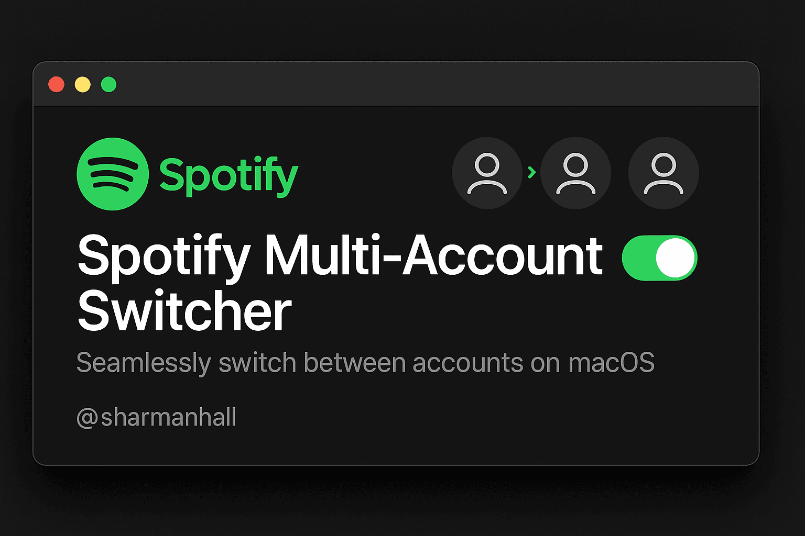

# Spotify Multi-Account Switcher for macOS

<div align="center">
  
</div>

<div align="center">
  <h3>🎵 Seamlessly switch between multiple Spotify accounts on macOS without re-entering credentials</h3>
</div>

## Why This Tool?

Spotify doesn't natively support multiple account switching on desktop. This tool solves that by maintaining separate profile folders for each account, preserving login tokens, preferences, and history.

## ✨ Features

- **Zero Password Storage** - Uses Spotify's existing login tokens
- **Instant Switching** - One command switches accounts and launches Spotify  
- **Preserved State** - Keeps playlists, preferences, and history separate
- **Cache Management** - Automatically clears volatile caches during switches
- **Backup Safe** - Non-destructive profile management

## 🚀 Quick Start

### Installation

```bash
# Download the script
curl -O https://raw.githubusercontent.com/tyhallcsu/spotify-multi-account-switcher/main/spotify-switcher.sh

# Make it executable
chmod +x spotify-switcher.sh

# Optional: Move to your PATH for global access
mv spotify-switcher.sh /usr/local/bin/spotify-switcher
```

### First-Time Setup

1. **Log into your first Spotify account** and quit Spotify
2. **Save it as a profile:**
   ```bash
   ./spotify-switcher.sh init work
   ```

3. **Log into your second account** and quit Spotify  
4. **Save that profile:**
   ```bash
   ./spotify-switcher.sh init personal
   ```

### Daily Usage

```bash
# Switch to work account
./spotify-switcher.sh switch work

# Switch to personal account  
./spotify-switcher.sh switch personal

# See all your profiles
./spotify-switcher.sh list
```

## 📖 Complete Usage

```bash
spotify-switcher.sh <command> [options]

Commands:
  list                    Show all saved profiles
  init <name>            Save current Spotify state as new profile
  switch <name>          Switch to profile and launch Spotify
  remove <name>          Delete a profile (with confirmation)
  open                   Open profiles folder in Finder
  help                   Show this usage information
```

## 🛠 Advanced Usage

### Create Desktop Launchers

For one-click switching from Finder or Dock:

```bash
# Create launcher scripts
echo './spotify-switcher.sh switch work' > ~/Desktop/Spotify-Work.command
echo './spotify-switcher.sh switch personal' > ~/Desktop/Spotify-Personal.command

# Make them executable
chmod +x ~/Desktop/Spotify-*.command
```

Double-click to switch accounts instantly.

### Add to Shell Profile

Add to your `~/.zshrc` or `~/.bash_profile`:

```bash
alias spotify-work='spotify-switcher.sh switch work'
alias spotify-personal='spotify-switcher.sh switch personal'
alias spotify-list='spotify-switcher.sh list'
```

## ⚙️ How It Works

The switcher maintains separate copies of your Spotify application support folder for each account:

```
~/Library/Application Support/
├── Spotify/                    # Active profile
└── Spotify-Profiles/
    ├── work/                   # Work account data
    ├── personal/               # Personal account data  
    └── family/                 # Family account data
```

**On each switch:**
1. Kills any running Spotify processes
2. Swaps the active profile using `rsync` (fast, preserves permissions)
3. Clears volatile caches (GPU cache, browser cache, etc.)
4. Launches Spotify with the selected profile

**Preserved per profile:**
- Login tokens (no re-authentication needed)
- Downloaded music and cache
- Playlists and library
- Audio quality settings
- UI preferences and window state

## 🔧 Troubleshooting

<details>
<summary><strong>"Spotify support folder not found"</strong></summary>

Launch Spotify once, log in completely, then quit and retry the `init` command.
</details>

<details>
<summary><strong>UI crashes or graphics issues</strong></summary>

Uncomment this line in the script to disable GPU acceleration:
```bash
# open -a "$SPOTIFY_APP" --args --disable-gpu && exit 0
```
</details>

<details>
<summary><strong>Profiles not switching properly</strong></summary>

- Ensure Spotify is completely quit before switching
- Check that profile exists: `./spotify-switcher.sh list`
- Manually clear caches: `rm -rf ~/Library/Caches/com.spotify.client`
</details>

<details>
<summary><strong>Permission errors</strong></summary>

Make sure the script is executable and you have write access to `~/Library/Application Support/`
</details>

## 🖥 Tested Environment

- **MacBook Pro** 16-inch, 2023
- **Chip** Apple M2 Max  
- **Memory** 96 GB
- **macOS** Sequoia 15.6

Should work on all modern macOS versions with Intel or Apple Silicon.

## 🤝 Contributing

Issues and pull requests welcome! Please:

1. Test on your system first
2. Include your macOS version and hardware in bug reports
3. Check existing issues before creating new ones

## 📝 License

MIT License - see [LICENSE](LICENSE) file for details.

## 👨‍💻 Author

Created by [@sharmanhall](https://github.com/tyhallcsu)

---

**Like this tool?** Give it a ⭐ and share with other multi-account Spotify users!